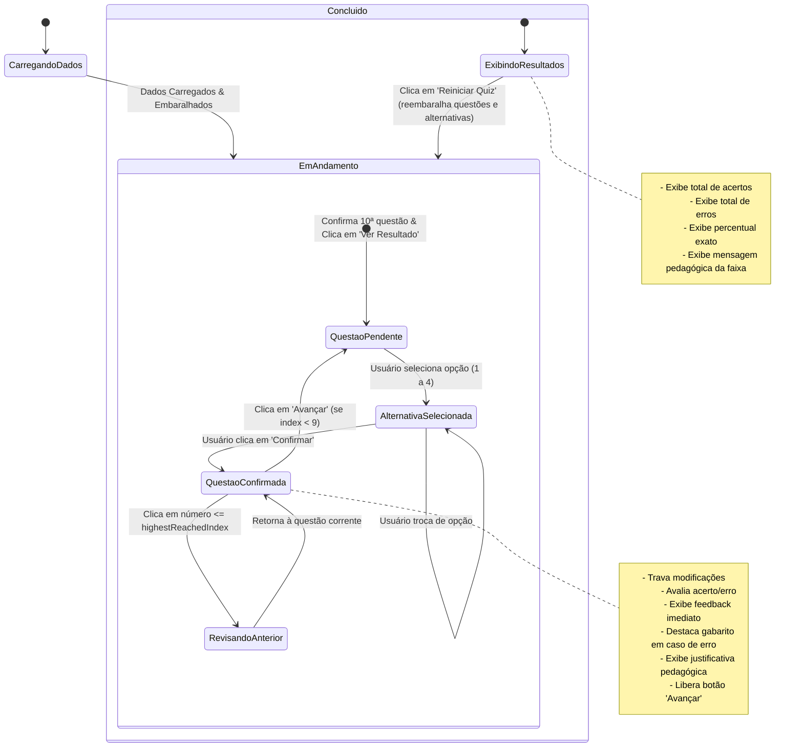

# Data Model: Quiz Computacional

**Feature**: [spec.md](spec.md) | **Date**: 2026-09-26

Este documento define o modelo de dados conceitual e estrutural da aplicação, suas entidades, validações e máquina de estados.

---

## 1. Entidades de Domínio

### 1.1 `Question` (Questão)
Representa uma questão do quiz sobre conceitos básicos de computação.

| Campo | Tipo | Obrigatório | Descrição |
|---|---|---|---|
| `id` | `string` | Sim | Identificador único imutável da questão (ex.: `"q01"`) |
| `statement` | `string` | Sim | Texto do enunciado da questão |
| `alternatives` | `Alternative[]` | Sim | Lista contendo **rigorosamente 4** alternativas |
| `correctAlternativeId` | `string` | Sim | ID da alternativa correta única |
| `explanation` | `string` | Sim | Explicação didática e justificativa pedagógica da resposta |

**Regras de Validação Constitucionais**:
- `alternatives.length` DEVE ser exatamente 4 (Princípio III).
- `correctAlternativeId` DEVE existir dentro de `alternatives` (Princípio IV).
- Não pode haver múltiplos identificadores iguais dentro de `alternatives`.
- Não pode haver duas alternativas com texto idêntico.

---

### 1.2 `Alternative` (Alternativa)
Representa uma opção de resposta para uma questão.

| Campo | Tipo | Obrigatório | Descrição |
|---|---|---|---|
| `id` | `string` | Sim | Identificador único imutável da alternativa (ex.: `"q01_a"`) |
| `text` | `string` | Sim | Texto legível da alternativa |

---

### 1.3 `UserAnswer` (Resposta do Usuário por Questão)
Registra o estado da interação do estudante com uma questão específica.

| Campo | Tipo | Obrigatório | Descrição |
|---|---|---|---|
| `questionId` | `string` | Sim | Identificador da questão respondida |
| `selectedAlternativeId` | `string \| null` | Sim | Alternativa selecionada pelo estudante (ou `null` se pendente) |
| `isConfirmed` | `boolean` | Sim | Se o estudante já confirmou a resposta (`true` trava modificações) |
| `isCorrect` | `boolean \| null` | Sim | `true` se acertou, `false` se errou, `null` se não confirmada |

---

### 1.4 `QuizSession` (Sessão do Quiz)
Mantém o estado ativo de uma tentativa do estudante.

| Campo | Tipo | Obrigatório | Descrição |
|---|---|---|---|
| `questions` | `Question[]` | Sim | Lista das 10 questões da sessão (com ordenação ativa da tentativa) |
| `currentIndex` | `number` | Sim | Índice da questão atualmente ativa no visualizador (0 a 9) |
| `highestReachedIndex` | `number` | Sim | Maior índice sequencial já alcançado pelo estudante (para controle da barra numérica) |
| `answers` | `Record<string, UserAnswer>` | Sim | Mapa de respostas por `questionId` |
| `status` | `'NOT_STARTED' \| 'IN_PROGRESS' \| 'COMPLETED'` | Sim | Estado global da sessão |

---

### 1.5 `QuizResult` (Resultado Final)
Consolidado final gerado após a confirmação da 10ª questão.

| Campo | Tipo | Obrigatório | Descrição |
|---|---|---|---|
| `totalQuestions` | `number` | Sim | Sempre fixo em 10 |
| `totalCorrect` | `number` | Sim | Quantidade de acertos (0 a 10) |
| `totalIncorrect` | `number` | Sim | Quantidade de erros (0 a 10) |
| `percentage` | `number` | Sim | Percentual exato: `(totalCorrect / 10) * 100` |
| `tier` | `'LOW' \| 'MEDIUM' \| 'HIGH'` | Sim | Faixa pedagógica atingida |
| `message` | `string` | Sim | Mensagem de incentivo e orientação pedagógica |

**Faixas de Aproveitamento Pedagógico**:
- `LOW` (0% a 40% / 0 a 4 acertos): *"Precisa revisar os conceitos fundamentais de computação. Tente novamente!"*
- `MEDIUM` (50% a 70% / 5 a 7 acertos): *"Bom desempenho! Você compreende a maioria dos conceitos básicos, mas ainda pode melhorar."*
- `HIGH` (80% a 100% / 8 a 10 acertos): *"Excelente domínio! Parabéns pelo seu conhecimento em fundamentos de computação!"*

---

## 2. Máquina de Estados e Ciclo de Vida da Sessão

