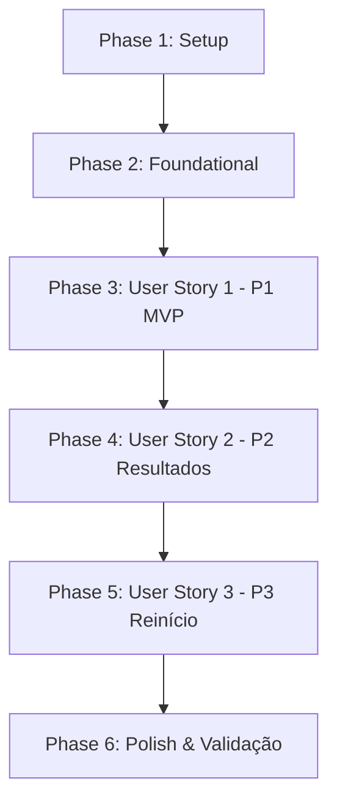

# Tasks: Quiz Computacional

**Feature**: [spec.md](spec.md) | **Plan**: [plan.md](plan.md) | **Date**: 2026-09-26

Este documento define a lista de tarefas acionáveis e ordenadas por dependência para a implementação completa da aplicação web Quiz Computacional.

---

## Phase 1: Setup (Shared Infrastructure)

**Purpose**: Inicialização da estrutura de pastas, configuração de scripts de teste e variáveis visuais base.

- [X] T001 Create project directory structure (`css/`, `data/`, `js/data/`, `js/logic/`, `js/ui/`, `tests/`) per implementation plan
- [X] T002 [P] Create `package.json` with test scripts for native Node.js test runner (`node --test`)
- [X] T003 [P] Create CSS foundation and design tokens in `css/style.css` (color palette, typography, visual variables, container card layout)

---

## Phase 2: Foundational (Blocking Prerequisites)

**Purpose**: Infraestrutura central de dados e motor lógico que DEVE estar concluída antes de qualquer User Story.

**⚠️ CRÍTICO**: Nenhuma User Story pode ser iniciada até a conclusão desta fase.

- [X] T004 Create static questions database in `data/questions.json` containing 10 basic computing questions, strictly 4 alternatives each, unique `correctAlternativeId`, and pedagogical explanation per `contracts/questions-schema.json`
- [X] T005 [P] Implement automated data validation test in `tests/questions-data.test.js` validating `data/questions.json` structure (10 questions, exactly 4 alternatives, valid correct ID, and non-empty explanation)
- [X] T006 [P] Implement data loader module in `js/data/question-loader.js` supporting asynchronous `fetch` with fallback for local `file://` protocol
- [X] T007 Implement core `QuizEngine` class foundation and Fisher-Yates shuffle algorithm in `js/logic/quiz-engine.js` with question/alternative randomization and session state initialization

**Checkpoint**: Base de dados e motor lógico prontos — a implementação das User Stories pode iniciar.

---

## Phase 3: User Story 1 - Resolução de Questões com Feedback Imediato (Priority: P1) 🎯 MVP

**Goal**: Permitir que o estudante visualize uma questão por vez com 4 alternativas, selecione uma opção, confirme, receba feedback imediato (acerto ou erro com destaque do gabarito e explicação), avance para a próxima questão ou revise questões anteriores pela barra numérica em modo somente leitura.

**Independent Test**: Iniciar o quiz, selecionar uma alternativa, confirmar a resposta, verificar se o feedback visual e pedagógico é apresentado corretamente, avançar para a próxima questão e clicar na barra numérica para rever questões respondidas em modo somente leitura.

### Tests for User Story 1 ⚠️

- [X] T008 [P] [US1] Unit test for single selection, answer confirmation, immediate evaluation, and state freezing in `tests/quiz-engine.test.js`
- [X] T009 [P] [US1] Unit test for numeric navigation bar and blocked forward jump in `tests/quiz-engine.test.js`

### Implementation for User Story 1

- [X] T010 [US1] Implement selection, confirmation, state freezing, and forward/backward navigation logic in `js/logic/quiz-engine.js` (depends on T008, T009)
- [X] T011 [P] [US1] Build semantic HTML structure for question card, 4 alternatives, feedback banner, numeric navigation bar, and action buttons in `index.html`
- [X] T012 [P] [US1] Style question card, interactive alternatives, feedback badges (success/error), and numeric navigation bar in `css/style.css`
- [X] T013 [US1] Implement DOM rendering, event listeners, feedback display, and numeric navigation interactions in `js/ui/quiz-ui.js` (depends on T010, T011, T012)

**Checkpoint**: User Story 1 (MVP) 100% funcional e testável de ponta a ponta de forma independente.

---

## Phase 4: User Story 2 - Apuração de Desempenho e Resultado Final (Priority: P2)

**Goal**: Ao concluir a 10ª questão, apresentar a tela de resultados finais consolidada com contagem de acertos, erros, percentual exato de aproveitamento e mensagem de avaliação pedagógica baseada em faixas de desempenho.

**Independent Test**: Responder todas as 10 questões, confirmar a última e verificar se a tela final exibe a contagem de acertos, contagem de erros, percentual `(acertos/10)*100%` e mensagem qualitativa correspondente.

### Tests for User Story 2 ⚠️

- [X] T014 [P] [US2] Unit test for score aggregation, percentage formula, and performance tier message mapping in `tests/quiz-engine.test.js`

### Implementation for User Story 2

- [X] T015 [US2] Implement `getResult()` with score computation and tier messaging in `js/logic/quiz-engine.js` (depends on T014)
- [X] T016 [P] [US2] Build HTML structure for results view, score cards, and performance message container in `index.html`
- [X] T017 [P] [US2] Style results score card, stat badges, and pedagogical feedback banner in `css/style.css`
- [X] T018 [US2] Implement transition from 10th question to results view and render score stats in `js/ui/quiz-ui.js` (depends on T015, T016, T017)

**Checkpoint**: User Stories 1 e 2 integradas e funcionais de forma independente.

---

## Phase 5: User Story 3 - Reinício do Questionário com Embaralhamento (Priority: P3)

**Goal**: Permitir que o estudante reinicie o quiz na tela de resultados com um único clique, restaurando o quiz para a Questão 1 com pontuação zerada e reembaralhando a ordem das 10 questões e de suas 4 alternativas.

**Independent Test**: Concluir o quiz, clicar em "Reiniciar Quiz" na tela de resultados e validar o retorno à Questão 1 com seleções e contadores zerados e nova ordem de questões/alternativas com gabarito íntegro.

### Tests for User Story 3 ⚠️

- [X] T019 [P] [US3] Unit test for restart state reset and Fisher-Yates reshuffling with invariant correct answer mapping in `tests/quiz-engine.test.js`

### Implementation for User Story 3

- [X] T020 [US3] Implement `restart()` method resetting session state and triggering fresh Fisher-Yates shuffle in `js/logic/quiz-engine.js` (depends on T019)
- [X] T021 [P] [US3] Add restart action button to results section in `index.html`
- [X] T022 [US3] Connect restart button click event to engine restart and reset UI view to question 1 in `js/ui/quiz-ui.js` (depends on T020, T021)

**Checkpoint**: Todas as User Stories (1, 2 e 3) integradas e funcionando com ciclo completo.

---

## Phase 6: Polish & Cross-Cutting Concerns

**Purpose**: Refinamento visual, responsividade mobile-first, acessibilidade e validação ponta a ponta.

- [X] T023 [P] Implement responsive media queries and touch optimization (buttons >= 48px, mobile layout) in `css/responsive.css`
- [X] T024 [P] Add keyboard accessibility (Enter/Space on alternatives and buttons, ARIA radiogroup) in `js/ui/quiz-ui.js` and `index.html`
- [X] T025 Execute all automated unit and data tests via `node --test tests/` and document validation results
- [X] T026 Validate all manual end-to-end scenarios per `specs/001-quiz-computacional/quickstart.md` in browser

---

## Dependencies & Execution Order

### Phase Dependencies

- **Setup (Phase 1)**: Sem dependências — pode iniciar imediatamente.
- **Foundational (Phase 2)**: Depende do Setup — **BLOQUEIA** todas as User Stories.
- **User Story 1 (Phase 3)**: Depende da conclusão da Phase 2 — Entrega o MVP.
- **User Story 2 (Phase 4)**: Depende da Phase 2 e integra com os dados da Phase 3.
- **User Story 3 (Phase 5)**: Depende da Phase 4 (tela de resultados finalizada).
- **Polish (Phase 6)**: Depende da conclusão das User Stories 1, 2 e 3.

### User Story Dependencies

---

## Parallel Opportunities

- **Fase 1 (Setup)**: `T002` (`package.json`) e `T003` (`css/style.css`) podem ser criados em paralelo após `T001`.
- **Fase 2 (Foundational)**: `T005` (`tests/questions-data.test.js`) e `T006` (`js/data/question-loader.js`) podem ser implementados em paralelo após `T004`.
- **Fase 3 (User Story 1)**:
  - Testes `T008` e `T009` podem ser escritos em paralelo.
  - HTML `T011` e CSS `T012` podem ser desenvolvidos em paralelo à lógica `T010`.
- **Fase 4 (User Story 2)**:
  - Teste `T014`, HTML `T016` e CSS `T017` podem ser criados em paralelo.
- **Fase 5 (User Story 3)**:
  - Teste `T019` e HTML `T021` podem ser criados em paralelo.
- **Fase 6 (Polish)**:
  - Responsividade `T023` e acessibilidade `T024` podem ser desenvolvidos em paralelo.

---

## Implementation Strategy

### MVP First (User Story 1 Only)

1. Concluir Phase 1 (Setup)
2. Concluir Phase 2 (Foundational - `questions.json`, carregador e base de `quiz-engine.js`)
3. Concluir Phase 3 (User Story 1 - fluxo de questão, seleção, confirmação, feedback e barra de navegação)
4. **Validar MVP**: Abrir `index.html` e verificar se a resolução interativa de questões com feedback funciona perfeitamente.

### Entrega Incremental

1. **Incremento 1 (MVP)**: Setup + Foundational + User Story 1 $\rightarrow$ Questionário interativo funcional.
2. **Incremento 2**: User Story 2 $\rightarrow$ Tela de resultados e métricas consolidadas.
3. **Incremento 3**: User Story 3 $\rightarrow$ Reinício com embaralhamento completo.
4. **Incremento 4 (Final)**: Responsividade smartphone/desktop, acessibilidade e suite de testes executada.
